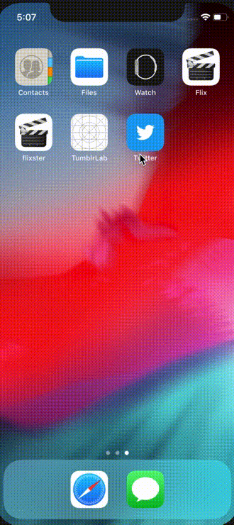
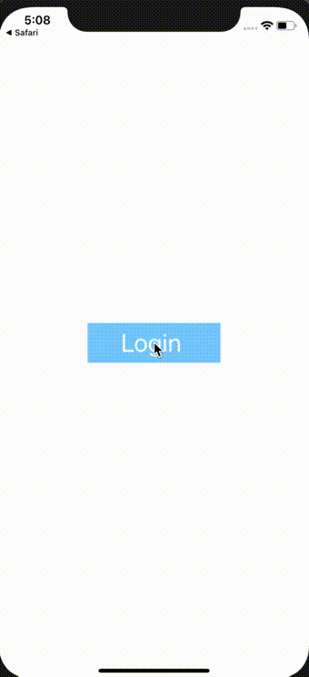
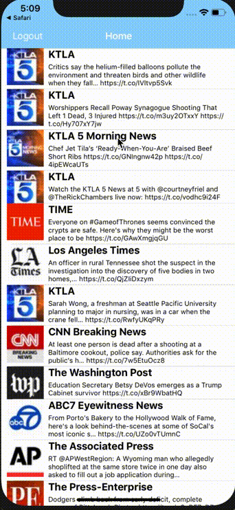

# Project 3 - *Twitter Mock*

**Twitter Mock** is a basic twitter app to read your tweets.

Time spent: **4** hours spent in total

## User Stories

The following **required** functionality is completed:

- [x] User sees app icon in home screen and styled launch screen. (1pt)
- [x] User can log in. (1pt)
- [x] User can log out. (1pt)
- [x] User stays logged in across restarts. (1pt)
- [x] User can view tweets with the user profile picture, username, and tweet text. (6pts)

The following **bonus** features are implemented:

- [x] User can pull to refresh. (1pt)
- [ ] User can load past tweets infinitely. (2pts)

## Video Walkthrough

Here's a walkthrough of implemented user stories:

### User sees app icon in home screen and styled launch screen

###  User can log in

### User can log out

### User stays logged in across restarts

### User can view tweets with the user profile picture, username, and tweet text + User can Pull to Refresh

